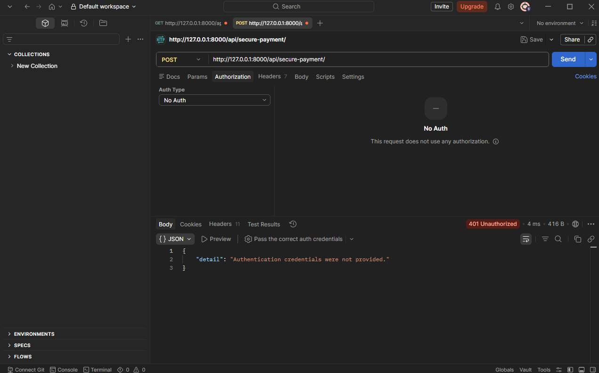
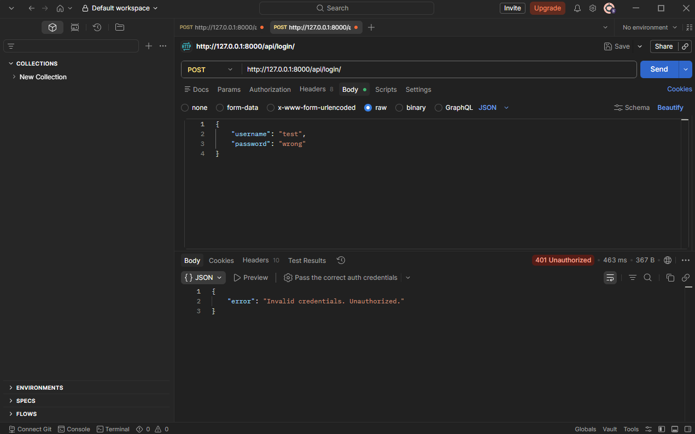
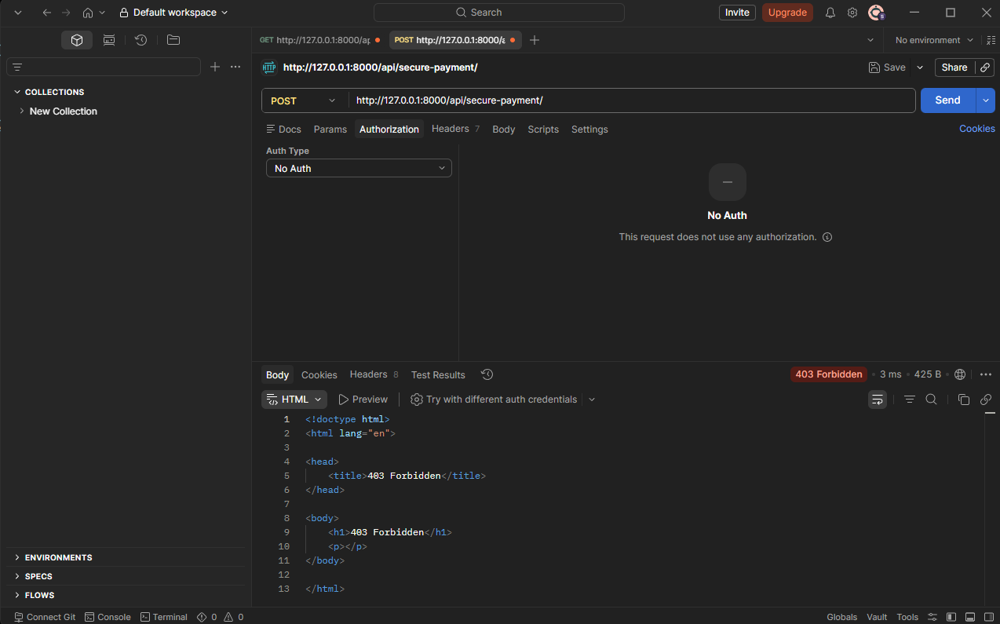
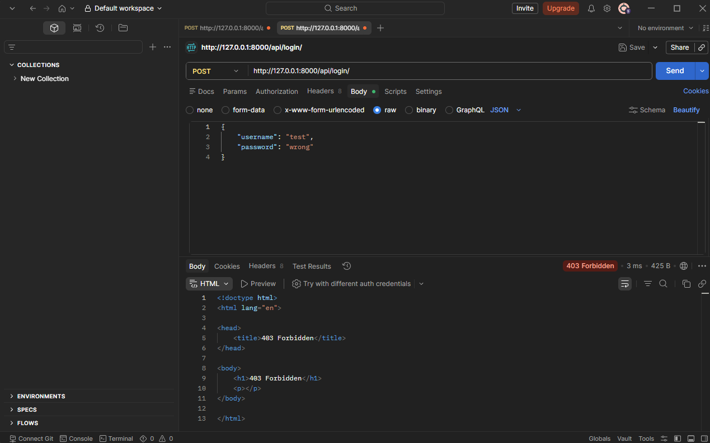
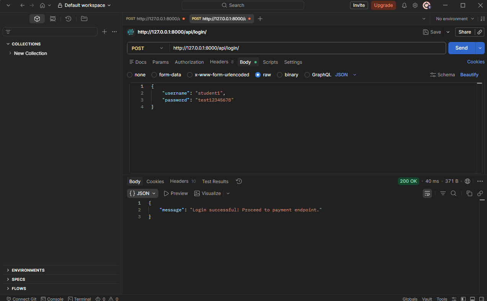
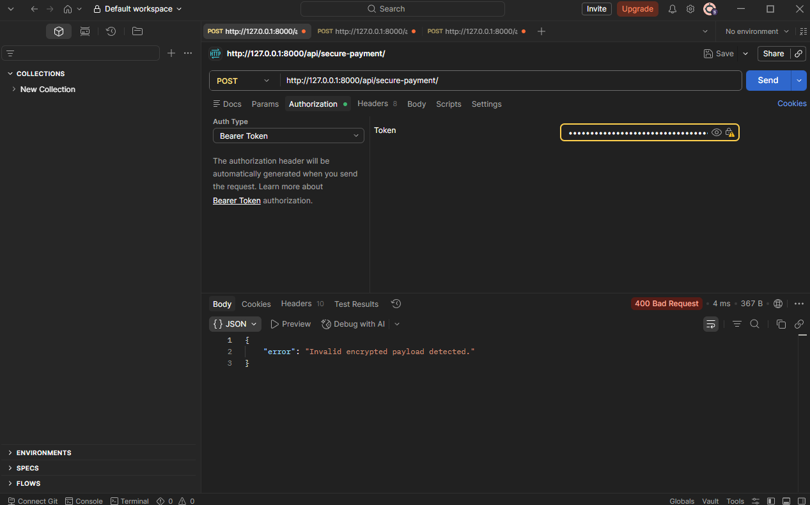
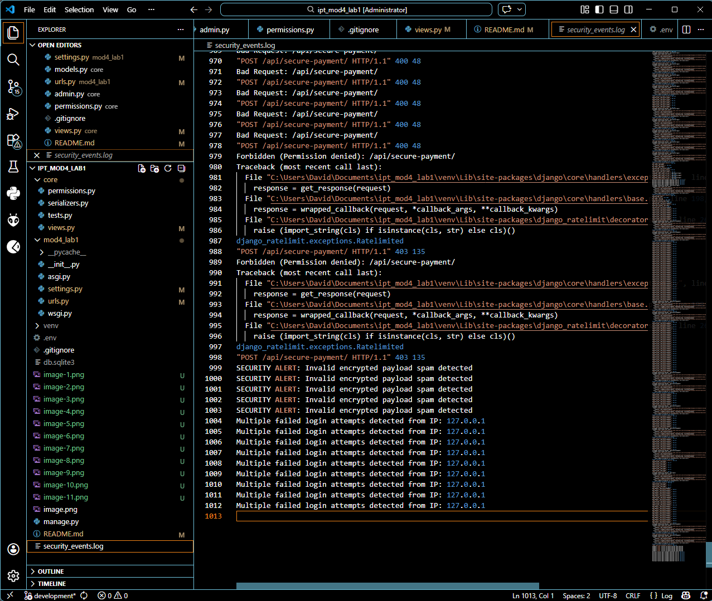
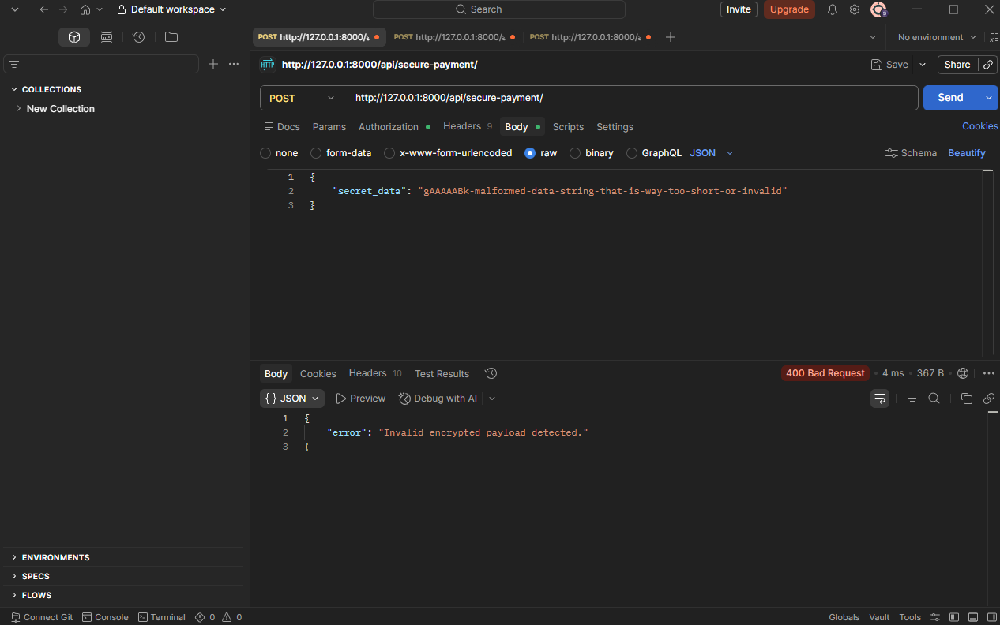
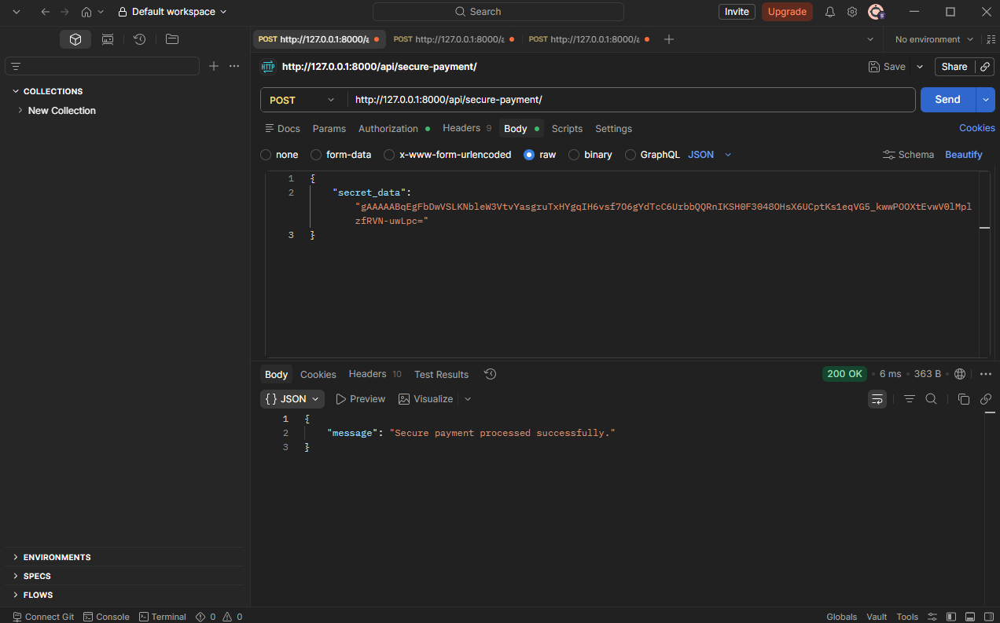

# IPT_Mod4_Lab2
by a potato

Reusing the old Mod4_lab1 activity by simply adding a payment api for tuition scenarios.

A Lab activity to satisfy the following:

Problem Scenario 
You are building a Secure Payment API that handles sensitive user information. 

The system must be able to.
● Encrypt sensitive fields.

Encypted credit card info:

● Hash passwords securely.

Hashed user password with argon2:

● Prevent brute-force attacks.

first login attempt without auth:

login attempt with pass and user:

after multiple attempts:

succesful logins:
user & pass

token. error 400 appears because no payload was delivered, but login is sucessful as we didnt get a 401 error.

● Log security-related events.
log of multiple attempted logins:

Students must test.
● Access without authentication. Done up top
● Excessive API requests. Done up top

● Invalid encrypted payloads.
when sending an invalid encrypted data:

when sending valid encrypted data:

